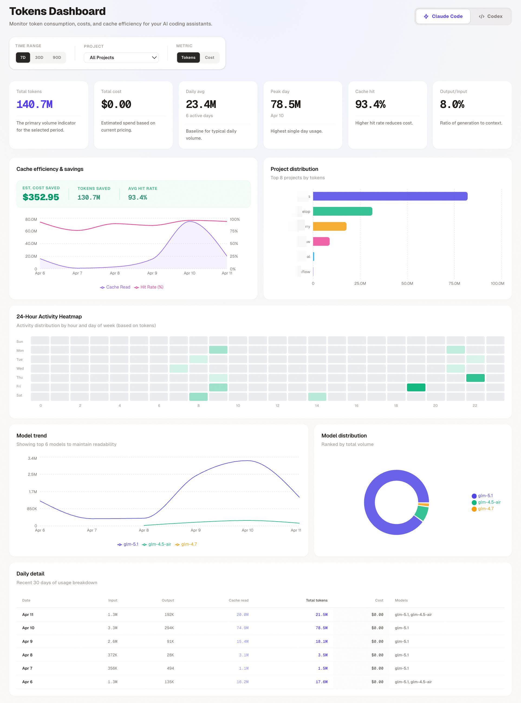
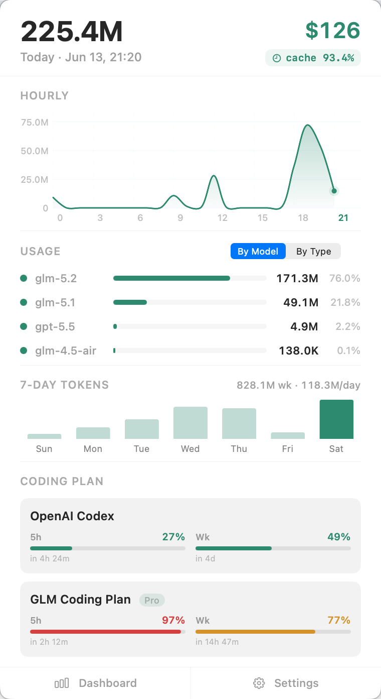

# tokendash

A beautiful, local web dashboard for visualizing your Claude Code, Codex, OpenClaw, and OpenCode token usage statistics.

It runs locally and parses token usage data directly from local session files, presenting it in a clean, interactive React dashboard. No external CLI dependencies required.



## Features

- **Multi-Agent Support:** View usage for Claude Code, Codex, OpenClaw, and OpenCode.
- **Direct JSONL Parsing:** Reads local session files directly — 100x faster data loading.
- **Detailed Metrics:** Track total tokens, cost (USD), active days, cache hit rates, and output/input ratio.
- **Today by Hour:** 24-hour token consumption panel showing hourly breakdown for the current day.
- **Code Analytics:** Visualize code change trends, tool call frequency, and productivity KPIs.
- **Interactive Charts:** Bar/line/area charts with tooltips, model breakdowns, and time range filtering.
- **24-Hour Heatmap:** Activity distribution by hour and day of week, with timezone awareness.
- **Model & Project Distribution:** See which models and projects drive your usage.
- **Persistent Filters:** Your selected time range, project, and metric mode are saved automatically.

## macOS Menu Bar App

TokenDash ships as a native macOS menu-bar-only application — no Dock icon, no window clutter. It lives quietly in your status bar and gives you instant access to your AI token usage at a glance.



**Status Bar Badge**
- Displays real-time token count (e.g. `1.2K`, `32.0M`) directly in the macOS status bar
- Updates every 5 seconds automatically
- Shows cost and cache hit rate in the tooltip on hover
- Resilient badge: transient network or data errors won't clear your existing badge value

**Popover Dashboard**
- Click the status bar icon to open a compact popover with today's full breakdown:
  - Total tokens, input/output/cache metrics at a glance
  - Hourly consumption bar chart with peak value highlight
  - Agent filter dropdown (show only Claude Code, Codex, etc.)
  - Settings: launch at login, check for updates, quit
- The popover syncs rendered totals back to the status bar badge for maximum accuracy

**Native Integration**
- Written in Swift (`trayHelper.swift`) for macOS 14+ compatibility
- Menu-bar-only (`LSUIElement: true`) — no Dock icon, runs silently in the background
- Dark mode support with automatic theme switching
- Custom app icon
- Distributed as a standard macOS DMG installer
- Port auto-detection with fallback — works even if port 3456 is already in use

## Requirements

- Node.js 20 or later
- npm or another Node package manager

## Installation & Usage

You can run the dashboard directly using `npx` without installing it globally:

```bash
npx @zhangferry-dev/tokendash
```

Or install it globally:

```bash
npm install -g @zhangferry-dev/tokendash
tokendash
```

By default, the backend server runs on port `3456`. When running the production build or installing globally, you access the dashboard at `http://localhost:3456`.

During development (`npm run dev`), Vite starts a separate development server on port `5173` with hot-module replacement. You should access the dashboard at `http://localhost:5173` while developing.

### macOS Menu Bar App

Download the latest `TokenDash-<version>-arm64.dmg` from [GitHub Releases](https://github.com/zhangferry/tokendash/releases). Open the DMG and drag TokenDash to your Applications folder. Launch it and the status bar icon appears immediately — no setup needed.

### Command Line Options

```bash
tokendash [options]

Options:
  --port <number>    Port to run the server on (default: 3456 or PORT env var)
  --no-open          Do not automatically open the browser
```

## Development

If you want to contribute or modify the dashboard locally:

1. Clone the repository:
   ```bash
   git clone <repository-url>
   cd tokendash
   ```

2. Install dependencies:
   ```bash
   npm install
   ```

3. Start the development servers (runs Vite for frontend and tsx for backend concurrently):
   ```bash
   npm run dev
   ```

4. Build for production:
   ```bash
   npm run build
   ```

5. Run the production build locally:
   ```bash
   npm start
   ```

## Architecture

- **Frontend:** React 19, Recharts, Tailwind CSS (via Vite plugin), built with Vite.
- **Backend:** Express, TypeScript.
- **Data Source:** All agent data is parsed directly from local session files (`~/.claude/projects/`, `~/.codex/sessions/`) and OpenCode's SQLite database (`~/.local/share/opencode/opencode.db`). No external CLI dependencies.
- **Caching:** Persistent disk cache (`/tmp/tokendash-cache/`) with stale-while-revalidate pattern for snappy UI updates.
- **Testing:** Vitest (unit), Playwright (E2E). Run with `npm test` and `npm run test:e2e`.
- **CI:** GitHub Actions pipeline for automated testing on every push and PR.

## License

[MIT](./LICENSE)
