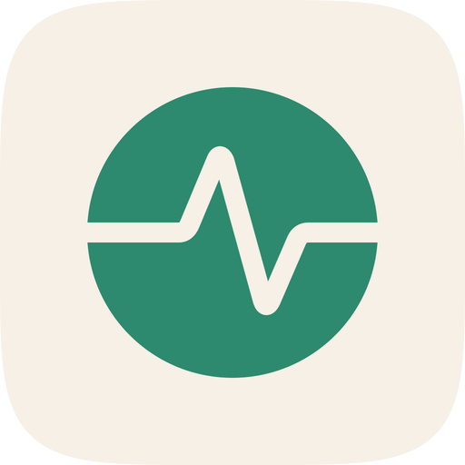
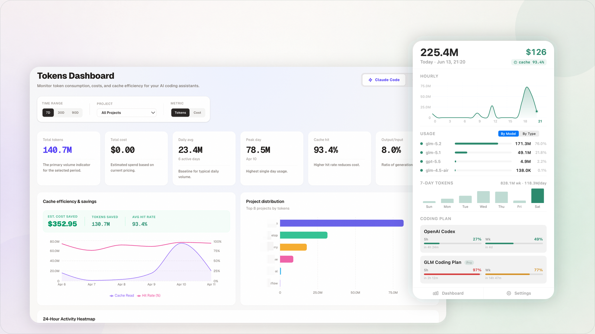

<div align="center">
  # TokenDash

  **Your local command center for AI coding usage.**

  Track tokens, costs, models, projects, and coding-plan limits from the macOS menu bar, with a detailed local dashboard when you need to dig deeper.

  [](https://github.com/zhangferry/tokendash/releases/latest)
  [](https://www.npmjs.com/package/@zhangferry-dev/tokendash)
  [](https://github.com/zhangferry/tokendash/actions/workflows/test.yml)
  [](LICENSE)

  [Download for macOS](https://github.com/zhangferry/tokendash/releases/latest) · [Run with npx](#run-the-web-dashboard) · [Features](#what-you-get) · [Development](#development)
</div>

<p align="center">
  
</p>



## Why TokenDash?

AI coding tools make it easy to consume millions of tokens without a clear picture of where they went. TokenDash turns local session data into an at-a-glance view of today's activity and a deeper history of your usage.

- **Glanceable by design** — see today's tokens, estimated cost, cache rate, model mix, and quota status without leaving the menu bar.
- **One view across tools** — bring Claude Code, Codex, OpenClaw, and OpenCode usage into the same product.
- **Local-first** — usage history is parsed directly from files already stored on your machine.
- **Useful beyond totals** — understand hourly activity, model and project distribution, cache efficiency, code changes, and tool calls.
- **No companion analytics service** — the dashboard runs on your computer and does not require an account.

## Quick Start

### macOS Menu Bar App

The native menu bar app is the recommended way to use TokenDash.

1. Download the latest Apple silicon DMG from [GitHub Releases](https://github.com/zhangferry/tokendash/releases/latest).
2. Open the DMG and drag **TokenDash** into **Applications**.
3. Launch TokenDash. It will detect supported AI coding tools and start the local dashboard automatically.

TokenDash requires **macOS 14 or later**. It runs as a menu-bar-only app, so it does not add an icon to the Dock.

### Run the Web Dashboard

On macOS, Linux, or Windows, run the local web dashboard with Node.js 20 or later:

```bash
npx @zhangferry-dev/tokendash
```

TokenDash opens `http://localhost:3456` automatically. No global installation is required.

## What You Get

### A Native macOS Companion

The menu bar keeps the information you check most often close at hand:

- Live token total in the status bar
- Today's token and estimated cost summary
- Hourly consumption chart and seven-day trend
- Usage breakdown by model and token type
- Coding-plan usage with reset countdowns
- Configurable low-quota notifications
- Launch at login, light/dark appearance, and automatic update checks

<p align="center">
  
</p>

### A Detailed Local Dashboard

Open the full dashboard when you want to investigate a spike or understand longer-term patterns:

- Token and cost views across today, 7, 30, 60, or all days
- Per-project and per-model distribution
- Input, output, cache creation, and cache read metrics
- Cache efficiency and estimated savings
- Hour-by-day activity heatmap
- Daily trends and session-level breakdowns
- Code change, tool call, and productivity analytics where supported
- Persistent agent, project, time-range, and metric filters


## Supported Tools

### Usage Analytics

| Tool | Local data source | Usage history | Code analytics |
| --- | --- | :---: | :---: |
| Claude Code | `~/.claude/projects/` | Yes | Yes |
| OpenAI Codex | `~/.codex/sessions/` | Yes | — |
| OpenClaw | `~/.openclaw/sessions/` | Yes | Yes |
| OpenCode | `~/.local/share/opencode/opencode.db` | Yes | — |

TokenDash only shows tools it detects on the current machine.

### Coding-Plan Quotas

The macOS app can also display the current limits reported by:

- Claude Code
- OpenAI Codex
- GLM Coding Plan
- MiniMax Coding Plan
- Kimi Code

Claude Code and Codex reuse their existing local authentication. Credentials entered for other providers are stored in `~/.tokendash/credentials.json` with owner-only file permissions.

## Privacy

TokenDash is local-first:

- Session history is read and processed on your machine.
- The web dashboard and its API are served locally.
- TokenDash does not upload usage history to a TokenDash service.
- No TokenDash account, telemetry endpoint, or external analytics database is required.

When coding-plan monitoring is enabled, TokenDash contacts the corresponding provider's API to retrieve current quota information. Only the authentication and request data required by that provider is sent; your local session history is not included.

## CLI

Install globally if you prefer a persistent command:

```bash
npm install -g @zhangferry-dev/tokendash
tokendash
```

Available options:

```text
tokendash [options]

--port <number>  Port for the local server (default: 3456 or PORT)
--no-open        Start without opening a browser
--version, -v    Print the installed version
```

During development, Vite serves the frontend at `http://localhost:5173`; packaged and npm installations use the local server port.

## How It Works

TokenDash consists of three small layers:

1. **Local parsers** read each supported tool's session files or database.
2. **An Express API** validates and caches normalized usage data.
3. **Two interfaces** present the same data: a React analytics dashboard and a native SwiftUI macOS menu bar app.

Data is cached locally with a stale-while-revalidate strategy so the interface remains responsive while files are being reparsed.

## Development

```bash
git clone https://github.com/zhangferry/tokendash.git
cd tokendash
npm install
npm run dev
```

Common commands:

| Command | Purpose |
| --- | --- |
| `npm run dev` | Start the Express and Vite development servers |
| `npm run build` | Build the web client and server |
| `npm run build:swift` | Build the native macOS app |
| `npm run build:dmg` | Package the macOS app and DMG |
| `npm run typecheck` | Type-check the server and frontend |
| `npm test` | Run Vitest unit tests |
| `npm run test:e2e` | Run Playwright end-to-end tests |

The web client uses React, TypeScript, Tailwind CSS, Recharts, and Vite. The local server uses Express and Zod. The macOS app is built with SwiftUI and Sparkle.

## Contributing

Issues and pull requests are welcome. For a new integration, keep the parser boundary consistent by implementing daily, project, and block responses, then wire detection, API routing, and the agent switcher.

Before submitting a change, run:

```bash
npm run typecheck
npm test
npm run test:e2e
```

## License

TokenDash is available under the [MIT License](LICENSE).
